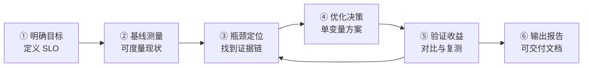

# Ch27：从性能分析到系统优化的完整工程闭环——端到端压测方法论

> 这是全课程最后一课，也是 8 个综合项目的总装。
> 前面 26 章分别讲了指标、GPU 硬件、算子、分布式、推理系统，
> 本章把它们串成一条可交付的工程流水线：
> **明确目标 → 基线测量 → 瓶颈定位 → 优化决策 → 验证收益 → 输出技术报告**。
> 学完本章，你应该能独立完成一次「推理系统端到端压测与优化」，并写出合格的技术报告。

## 学习目标

- 掌握 AI 系统优化的「工程闭环六步法」，能按步骤组织一次端到端压测实验
- 能把 8 个综合项目中的 P1（指标看板）、P2（Profiler）、P4（算子优化）、P7（推理服务）组装成一次完整的「压测→定位→优化→验证」闭环
- 会用 Roofline / KV Cache 显存 / 调度三个视图交叉定位推理系统瓶颈，并给出带证据的结论
- 能设计「一次只改一个变量」的优化实验，正确归因收益并排除噪声
- 能按 7 段式结构输出一份端到端优化报告（含前后对比表），支撑决策与交付

## 核心概念

### 1. 工程闭环六步法

工程优化最忌「感觉慢就瞎改」。一套可复现、可验证、可沉淀的流程，是 AI Infra 工程师与
「玄学调优」的分水岭。六步闭环如下：



| 步骤 | 做什么 | 输出什么 |
|------|--------|----------|
| ① 明确目标 | 与业务方对齐 SLO：吞吐（QPS/Tokens/s）、时延（TTFT/TPOT）、成本（每 token 成本） | SLO 清单（可量化、有截止时间） |
| ② 基线测量 | 用同一套负载跑通现状，记录全部指标与配置 | 基线指标表 + 复现步骤 |
| ③ 瓶颈定位 | Roofline 分类、访存/显存分析、调度分析、Profiler 时间线，交叉验证 | 瓶颈证据清单（E1/E2/E3…） |
| ④ 优化决策 | 针对每条证据设计优化项，坚持「一次只改一个变量」 | 优化方案表（改什么/为什么/预期收益） |
| ⑤ 验证收益 | 同一负载重跑，统计前后对比；必要时多轮「验证→再定位」迭代 | 前后对比表 + 稳定性复测 |
| ⑥ 技术报告 | 整理目标/环境/数据/结论，给出投入产出与后续建议 | 可交付的技术报告（7 段式） |

> 关键认知：**⑥ 报告不是可选项**。没有报告的优化等于没做——下一次换个人、换个负载，
> 结论就丢了。报告里的「前后对比表 + 复现步骤」才是工程资产。

### 2. 端到端压测方法论

一次合格的压测，需要先回答三个问题：

1. **压什么**：明确被测对象（推理服务整体 / 单算子 / 单阶段 prefill / decode），
   本课压的是「带调度的单卡推理服务」整体。
2. **怎么压**：固定负载分布（请求数、输入/输出长度分布、到达速率），保证优化前后负载一致，
   否则对比失真。本 Demo 用 20% 长请求 + 80% 短请求模拟真实业务（长短混合最能暴露调度问题）。
3. **怎么量**：统一指标口径。吞吐看 QPS 与 Tokens/s（生成），有效产出看 Goodput（扣重试），
   时延看 TTFT/TPOT/ITL，机器看带宽利用率与 MFU。

压测的「前测-后测」必须满足：**同硬件、同负载、同脚本，只改优化变量**。
收益显著大于测量噪声（多次采样看均值与方差）才算验证通过。

### 3. 综合实战场景：一次 8 项目的总装

本 Demo 把 8 个综合项目中的四个组装成一条流水线：

| 项目 | 在本闭环中的角色 |
|------|------------------|
| P1 指标看板 | 提供 QPS/Tokens/s/Goodput/TTFT/TPOT 指标口径与计算（metrics.py） |
| P2 Profiler 定位 | 提供瓶颈定位方法：Roofline 算子分类 + 步时分解 + 调度分析 |
| P4 算子优化 | 提供「减少访存」手段：算子融合把访存密集算子推向 Roofline 上界 |
| P7 推理服务 | 提供「系统级」优化：KV Cache、连续批、分页显存管理 |

**被测系统**（模拟口径，数字由 gpu_specs.py 提供）：

| 配置项 | 值 |
|--------|-----|
| GPU | A100 SXM 80G（FP16 312 TFLOPS / HBM 2.04 TB/s / 80GB） |
| 模型 | 7B 参数，GQA：L32 · H32 · KV8 · head_dim 128，FP16 |
| 权重体积 | 7B × 2B = 14GB（decode 每步需流式读一遍，带宽墙 6.9ms） |
| 负载 | 200 请求，输入 256 token，输出 20% 长（80~120）+ 80% 短（5~15） |
| 基线配置 | 静态批 batch=8 ＋ 无 KV Cache ＋ 未融合算子 |
| 优化配置 | 连续批 max_concurrent=32 ＋ KV Cache ＋ 算子融合 |

**优化目标（SLO）**：生成吞吐 ≥ 800 tokens/s；平均排队等待 < 0.5s。

### 4. 三个瓶颈视图与优化手段的对应

| 视图 | 分析工具（shared 库） | 发现 | 对应优化 |
|------|----------------------|------|----------|
| 计算/访存 | roofline.py 算子分类 | decode 链路全部访存密集（AI 0.2~0.8 ≪ 转折点 152.9） | 算子融合、KV Cache 减少访存 |
| 显存/注意力 | kv_cache.py 代价模型 | 无缓存注意力 O(T²)；高并发被 KV 显存预算卡住 | KV Cache + Paged 分页 |
| 调度 | scheduler.py | 静态批凑批等待 289 步，并发只有 8 | 连续批，并发 8→32 |

## 关键代码

以下代码为 `demos/ch27/main.py` 的核心逻辑摘录，完整可运行版本见该文件。
运行方式：`python demos/ch27/main.py`（纯 Python 模拟，无需 GPU）。

### 代码 1：完整可运行的六步闭环（核心逻辑）

以下为 `demos/ch27/main.py` 的核心闭环（简化去掉了报告排版），即该文件的主干逻辑。
直接运行 `python demos/ch27/main.py` 可看到完整输出；把本代码块保存为
`demos/ch27/_core.py` 也可独立运行（sys.path 指向 `../shared`，需位于章节子目录内）：

```python
"""Ch27 核心闭环：目标→基线→定位→优化→验证（完整可运行）"""
import os, sys, random
if hasattr(sys.stdout, "reconfigure"):
    sys.stdout.reconfigure(encoding="utf-8")
sys.path.insert(0, os.path.abspath(os.path.join(os.path.dirname(__file__), "..", "shared")))

from gpu_specs import get_spec
from roofline import RooflineModel, gemm_ai, elementwise_ai
from metrics import qps, tokens_per_second, kv_cache_bytes
from scheduler import StaticBatcher, Request

GPU = get_spec("A100_SXM")              # 312 TFLOPS FP16 / 2.04 TB/s / 80GB
PARAMS_B, N_REQS = 7.0, 200             # 7B 参数、200 请求
WEIGHT_BYTES = int(PARAMS_B * 1e9 * 2)  # 权重 14GB → decode 带宽墙 6.9ms
EFF_B, EFF_O = 0.55, 0.80               # 基线/优化后的实测步进效率


def fresh_arrivals(seed=7):             # 每次调用生成全新请求（run() 会原地改对象）
    rng = random.Random(seed)
    return [Request(req_id=i, arrival_step=i,
                    total_tokens=rng.randint(80, 120) if rng.random() < 0.2
                    else rng.randint(5, 15)) for i in range(N_REQS)]


def decode_step_ms(eff, batch=32):      # 带宽墙步时模型
    mem_ms = WEIGHT_BYTES / (GPU.hbm_bw_tbs * 1e12) * 1000
    compute_ms = batch * 2 * PARAMS_B * 1e9 / (GPU.fp16_tflops * 1e12) * 1000
    return max(mem_ms, compute_ms) / eff


class ContinuousBatcherV2:              # 修正版连续批：过载进就绪队列（不丢请求）
    def __init__(self, max_concurrent):
        self.max_concurrent = max_concurrent
        self.ready, self.active = [], []

    def run(self, arrivals, max_steps=5000):
        completed = step = qi = 0
        total_wait = 0.0
        while completed < len(arrivals) and step < max_steps:
            while qi < len(arrivals) and arrivals[qi].arrival_step <= step:
                self.ready.append(arrivals[qi]); qi += 1       # 到达 → 就绪队列
            while len(self.active) < self.max_concurrent and self.ready:
                self.active.append(self.ready.pop(0))          # 就绪 → 活跃槽位
            if not self.active:
                step += 1; continue
            for r in self.active:                              # 每活跃请求推进 1 token
                r.done_tokens += 1
            done = [r for r in self.active if r.finished]
            completed += len(done)
            for r in done:
                total_wait += (step + 1) - r.arrival_step
            self.active = [r for r in self.active if not r.finished]
            step += 1
        return {"steps": step, "completed": completed,
                "avg_wait": total_wait / max(1, completed)}


# ---- 六步闭环：① 目标(SLO) → ② 基线 → ③ 定位 → ④ 优化 → ⑤ 验证 ----
total_out = sum(r.total_tokens for r in fresh_arrivals())       # 输出 token 合计

sb = StaticBatcher(batch_size=8).run(fresh_arrivals())          # ② 基线：静态批 8
wall_b = sb["steps"] * decode_step_ms(EFF_B) / 1000

rl = RooflineModel(GPU.fp16_tflops * 1e12, GPU.hbm_bw_tbs * 1e12, GPU.name)
print(f"转折点 ridge = {rl.ridge_point:.1f}，elementwise 是 "      # ③ 定位：Roofline
      f"{rl.bound_type(elementwise_ai(1_000_000))}，4096³ GEMM 是 "
      f"{rl.bound_type(gemm_ai(4096, 4096, 4096))}")

cb = ContinuousBatcherV2(32).run(fresh_arrivals())              # ④ 优化：连续批 32
wall_o = cb["steps"] * decode_step_ms(EFF_O) / 1000

print(f"KV 显存(32并发×seq4096) = "                            # KV Cache 显存预算
      f"{kv_cache_bytes(32, 32, 128, 4096, 32, 2, 8)/1e9:.1f} GB")
print(f"基线  QPS={qps(N_REQS, wall_b):.1f}  "
      f"Tokens/s={tokens_per_second(total_out, wall_b):.1f}")
print(f"优化  QPS={qps(N_REQS, wall_o):.1f}  "                  # ⑤ 验证：前后对比
      f"Tokens/s={tokens_per_second(total_out, wall_o):.1f}")
print(f"吞吐提升 {qps(N_REQS, wall_o) / qps(N_REQS, wall_b):.2f}x")
```

> 带宽墙是理解 LLM decode 的关键：每生成一个 token 都要把全部权重从 HBM 读一遍，
> 所以 decode 是「带宽密集」而非「计算密集」。这解释了为什么并发提升吞吐
> （一次读权重、服务多个序列），而 MFU 在 decode 阶段天然偏低。
>
> 注意：`scheduler` 的 `run()` 会原地修改 `Request.done_tokens`，多个调度器对比时
> 必须每次生成全新的 Request 对象（`fresh_arrivals()`）；共享库 `ContinuousBatcher`
> 在并发满时直接丢包，真实系统用就绪队列（本代码中的 V2）与 vLLM 的 running queue 同构。

### 代码 2：瓶颈定位——Roofline + KV + 调度三视图

```python
# ① Roofline 分类：A100 转折点 = 312/2.04 = 152.9 FLOPs/byte
rl = RooflineModel(GPU.fp16_tflops * 1e12, GPU.hbm_bw_tbs * 1e12, GPU.name)
for name, ai in [("elementwise", elementwise_ai(1_000_000)),     # 0.25 → memory-bound
                 ("softmax", softmax_ai(512, 4096)),             # 0.83 → memory-bound
                 ("小GEMM512³", gemm_ai(512, 512, 512)),         # 170.7 → compute-bound
                 ("大GEMM4096³", gemm_ai(4096, 4096, 4096))]:    # 1365 → compute-bound
    print(name, rl.bound_type(ai), rl.achievable_perf(ai) / 1e12)

# ② KV Cache：无缓存注意力代价 O(T²)
eng = KVCacheEngine(32, 32, 128, num_kv_heads=8)
c  = eng.compute_attention_cost(4096, cached=True)
nc = eng.compute_attention_cost(4096, cached=False)   # 含 recompute_ops
print(f"seq=4096 有缓存 {c['compute_ops']:,} ops | 无缓存 "
      f"{nc['compute_ops']+nc['recompute_ops']:,} ops")

# ③ KV 显存规划：2·L·kv·d·seq·batch·2B
print(f"32并发×seq4096: {kv_cache_bytes(32,32,128,4096,32,2,8)/1e9:.1f} GB")

# ④ 调度：静态批基线
sb = StaticBatcher(batch_size=8).run(fresh_arrivals())
print(f"静态批完成 {N_REQS} 请求需 {sb['steps']} 步，平均等待 {sb['avg_wait']:.0f} 步")
```

### 代码 3：验证收益并输出前后对比

```python
# 基线：741 步 × 12.5ms = 9.25s → QPS 21.6，Tokens/s 604
# 优化：289 步 × 8.6ms  = 2.48s → QPS 80.7，Tokens/s 2254
before = {"steps": 741, "step_ms": 12.5, "wall_s": 9.25, "total_out": 5587,
          "avg_wait_steps": 289.2, "ttft_ms": 19.1, "tpot_ms": 12.5}
after  = {"steps": 289, "step_ms": 8.6,  "wall_s": 2.48, "total_out": 5587,
          "avg_wait_steps": 29.4, "ttft_ms": 15.3, "tpot_ms": 8.6}

def row(name, b, a, unit=""):
    if unit == "s":  b, a = f"{b:.2f}s", f"{a:.2f}s"
    if unit == "ms": b, a = f"{b:.1f}ms", f"{a:.1f}ms"
    return f"{name:<24}{b:>14}{a:>14}  ×{before['wall_s']/after['wall_s']:.2f}"

print(f"{'指标':<24}{'优化前':>14}{'优化后':>14}")
print(row("总时长(解码)", before["wall_s"], after["wall_s"], "s"))
print(row("平均排队等待", before["avg_wait_steps"]*before["step_ms"]/1000,
          after["avg_wait_steps"]*after["step_ms"]/1000, "s"))
```

## 课堂练习

### ⭐ 基础：读懂一次压测报告

运行 `python demos/ch27/main.py`，对照输出回答：
1. 基线为什么没达到 SLO（800 tokens/s）？三个瓶颈证据分别指向什么优化？
2. 优化后 QPS 提升 3.73x，主要来自哪个变量？（提示：并发度从 8 变到多少）
3. 平均排队等待从 3.61s 降到 0.25s，这个收益来自连续批的哪个特性？
4. 在报告里找到 KV Cache 显存占用，写出它的计算公式并验算 32 并发 × seq 4096 的值。

### ⭐⭐ 进阶：单变量归因实验

把「优化后」拆成三个独立实验，回答每次只改一个变量时分别能验证什么：
1. **只开 KV Cache**（保持静态批 8、不融合）：观察注意力代价从 O(T²) 变 O(T)，
   但吞吐为什么提升有限？（提示：静态批并发仍是 8，每步产出 token 数没变）
2. **只上连续批并发 8**（不开并发扩展）：用 `ContinuousBatcherV2(8)` 与 `StaticBatcher(8)`
   对比步数与平均等待，解释「同样并发下吞吐相近、等待更低」的现象。
3. **只做算子融合**：把 `EFF_OPTIMIZED` 单独改回 0.55，观察 TPOT 是否下降、吞吐是否变化。
4. 用代码 3 的表格把三个实验合并成「多变量总装」，说明为什么总装收益 ≈ 各变量收益的叠加。

### ⭐⭐⭐ 挑战：设计你自己的端到端压测

选一个真实或半真实的推理场景（比如手头模型 + vLLM，或用本 Demo 的模拟器），
按六步法做一次完整闭环，交付一份 7 段式报告：
1. 给出 SLO 与压测负载设计（长度分布、到达速率、预热/时长）
2. 用 Roofline 给出至少 2 个算子的分类与优化方向
3. 用 KV 显存公式估算目标并发下的显存预算，判断是否需分页/量化
4. 用静态批 vs 连续批对比验证调度收益，并做 3 次以上重复测量报告均值±方差
5. 报告里写清楚「遗留风险」（如长尾时延、显存碎片、多卡扩展性）

## 常见问题 Q&A

**Q1：优化后 QPS 提升 3.73x，但 TPOT 只从 12.5ms 降到 8.6ms，为什么两个收益差这么多？**
A：因为两个指标回答不同的问题。QPS/Tokens/s 是「吞吐」——连续批把并发从 8 提到 32，
每步服务的序列数翻了 4 倍，所以吞吐大幅上升；TPOT 是「单请求每 token 时延」——它由
带宽墙（权重流式读取）决定，只能靠融合/效率优化小幅改善。吞吐与时延是正交的两个维度：
**提吞吐靠并发与调度，降时延靠减访存与消碎片**。这也是为什么压测报告必须同时报两个口径。

**Q2：本 Demo 全是模拟，真实压测应该用什么工具、注意什么？**
A：模拟是为了在无 GPU 环境下讲清方法论；真实压测把模拟器替换为：指标采集用
`nvidia-smi`/`dcgm-exporter`，算子级定位用 `torch.profiler`/Nsight Systems/Compute，
服务压测用 `locust`/`wrk`/自写脚本（vLLM 自带 benchmark）。核心注意点与本 Demo 一致：
负载固定（同分布、同到达速率）、预热足够（排除冷启动）、多次测量看统计而非单次、
一次只改一个变量。真实系统还要小心分布式时钟、锁等待、网络抖动带来的测量噪声。

**Q3：共享库的 ContinuousBatcher 会丢请求，为什么 Demo 还要用它？**
A：这正是本 Demo 想教的一课：**读模拟器/库代码要带批判性**。`ContinuousBatcher` 在
并发槽位满时直接丢弃新到达请求，是为了简化「队列」逻辑，并非真实系统行为。Demo 先
打印它的丢包数（200 请求丢 10 个），再给出补上就绪队列的修正版 `ContinuousBatcherV2`
——这与 vLLM 的 running queue 设计同构。真实生产系统也必须有准入控制（max_num_seqs +
队列入队），否则高负载下同样会丢请求或 OOM。

**Q4：优化结果会不会是巧合？怎么确认收益可信？**
A：三件事：① 多次测量取均值与方差，收益必须大于噪声（如 σ=30ms 时收益 30% 以上才可信）；
② 用单变量对照（A 基线 / B 只改一个变量 / C 多变量），确保收益可归因到具体手段；
③ 复现性：换一批 seed、换一组负载分布重跑，结论方向一致才算稳。报告中应记录
「测量次数、均值±方差、复现条件」，这比一个孤立的加速比数字有价值得多。

## 小结

| 要点 | 说明 |
|------|------|
| 六步闭环 | 目标→基线→定位→优化→验证→报告，缺一不可，报告是工程资产 |
| 压测方法论 | 负载固定、口径统一、预热充分、多次测量、单变量归因 |
| 三个瓶颈视图 | Roofline（计算/访存）、KV 显存（内存预算）、调度（并发/等待） |
| decode 带宽墙 | 每 token 需流式读一遍权重 → decode 是访存密集，吞吐靠并发摊薄 |
| KV Cache | 注意力 O(T²)→O(T)，公式 2·L·kv·d·seq·batch·2B，配分页按需分配 |
| 连续批 | 随到随跑、免凑批等待，配合高并发（8→32）实现 3.73x 吞吐 |
| 算子融合 | 减少访存次数，把访存密集算子推向 Roofline 上界，同时降 TPOT |
| 7 段式报告 | 摘要/环境/基线/瓶颈/方案/验证/结论，支撑交付与决策 |

## 课程总结与后续学习路径

### 1. 8 个综合项目总览

| # | 项目 | 关联阶段 | 核心产出 | 在本课程中的作用 |
|---|------|----------|----------|------------------|
| 1 | 性能基线与指标看板 | 阶段 0 | 指标计算库 + 可视化看板 | 提供一切优化的「尺子」（metrics.py） |
| 2 | Profiler 定位瓶颈 | 阶段 2 | Profiler 报告 + 优化清单 | 提供「定位」方法论 |
| 3 | CUDA 访存实验 | 阶段 2 | 访存模式对比数据 | 理解 Coalescing/共享内存 |
| 4 | Triton 融合算子 | 阶段 2 | 融合算子（含 Flash Attention） | 提供「算子级」优化手段 |
| 5 | 通信性能分析 | 阶段 3 | 通信耗时拆解 | 训练侧通信视角 |
| 6 | FSDP 显存优化 | 阶段 3 | 显存曲线 + FSDP 脚本 | 训练侧显存视角 |
| 7 | KV Cache 推理服务 | 阶段 5 | 可运行服务 + 吞吐对比 | 提供「系统级」优化手段 |
| 8 | 端到端压测与优化 | 阶段 6（本章） | 压测报告 + 优化验证 | 总装 P1/P2/P4/P7 成完整闭环 |

> 项目 1/2/4/7 是推理链路，项目 3/5/6 偏训练侧。本课已把 1/2/4/7 总装成一次端到端压测；
> 训练侧（5/6）用同样方法再做一次闭环，就同时掌握了训练与推理两条线的性能工程能力。

### 2. 面试要点清单

以下是本章及全课程最可能在面试中被追问的知识点，建议逐条自查：

- **公式级**：MFU = achieved/(峰值×时间)；Goodput = 有效产出/时间；
  KV Cache = 2·L·kv·d·seq·batch·2B；Roofline 转折点 = 峰值算力/峰值带宽
- **判断级**：给一个算子，能说出它的算术强度与瓶颈类型（计算密集 vs 访存密集）；
  decode 为什么是带宽墙；为什么 decode 阶段 MFU 天然低
- **设计级**：为什么 Continuous Batching 提升吞吐；为什么并发受显存预算约束；
  为什么优化必须单变量；为什么压测要固定负载与口径
- **系统级**：KV Cache 与 Paged Attention 的关系；prefill 与 decode 的调度差异；
  静态批 vs 连续批在时延/吞吐上的取舍；融合算子如何降低访存与 kernel 数
- **方法论级**：一次性能优化从接到需求到交付报告的完整流程（六步法）与输出物

### 3. 开源项目进阶方向

课程终点是开源项目源码的起点。按「先读论文 → 再读源码 → 最后动手改」的顺序进阶：

| 开源项目 | 对应课程章节 | 进阶切入点 |
|----------|--------------|------------|
| vLLM | Ch21-Ch23、Ch27 | PagedAttention 显存管理、Continuous Batching 调度器、PD 分离架构 |
| SGLang | Ch23-Ch25 | RadixAttention 前缀复用、推理调度与路由 |
| DeepSpeed | Ch16-Ch17 | ZeRO 分片、梯度压缩、通信 Overlap、推理加速（DeepSpeed-Inference） |
| Megatron-LM | Ch13-Ch15 | TP/PP/DP 组合策略、通信拓扑优化、核心算子（FlashAttention 变体） |

建议的进阶路线：先在本地跑起 vLLM 的 `benchmark_serving.py` 完成一次真实压测
（对应本章方法），再用 `torch.profiler` 复现一次 Roofline 定位，最后带着
「如果我来实现调度器会怎么写」的问题去读 vLLM 的 `scheduler.py` 与 `cache_engine.py`。

至此，28 章 + 8 个项目全部完成。你已具备从指标到优化、从训练到推理的完整
AI Infra 性能工程能力——剩下的，就是在一台真实 GPU 上，把这份方法变成你自己的压测报告。
