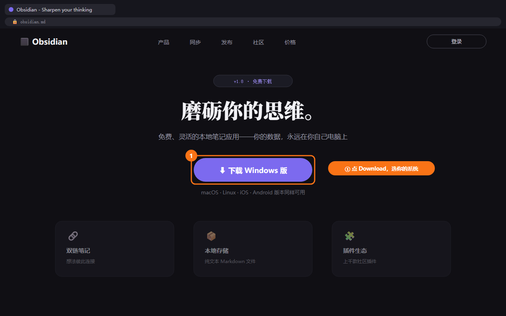
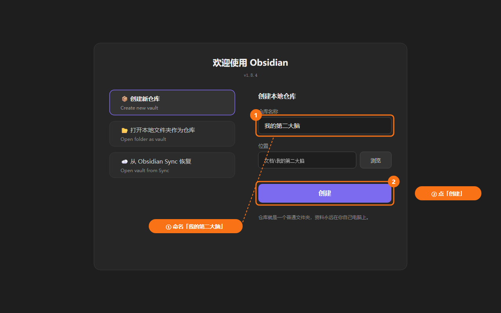

# D0: 开营准备清单

> ⏱️ 约 30 分钟 · 开营前一天完成 · 不计入 6 天正课

## 学习目标

- [x] 装好知识库工具 Obsidian
- [x] 注册好一个能用的 AI 对话工具
- [x] 知道自己的 20 份工作资料在哪（不用整理）
- [x] 明确 6 天的学习节奏和完成标准

**为什么要有准备日**：把"安装、注册、排错"这些最容易卡住人的事挪到正课之外。D1 开课即动手，不在环境问题上消耗意志力。

---

## 正文

### 任务一：安装 Obsidian（10 分钟）

Obsidian 是本课"第二大脑"的主载体——免费、本地存储、数据永远在你自己电脑上。

**操作步骤**：

1. 打开官网 `https://obsidian.md`
2. 点击 Download，选择你的系统（Windows / macOS）
3. 下载后双击安装，一路默认下一步
4. 首次打开 Obsidian，点击 **"Create new vault"（创建新仓库）**
5. 命名为 `我的第二大脑`，选择一个你找得到的文件夹（建议：`文档/我的第二大脑`）
6. 看到左侧出现空白的笔记列表 = 安装成功 ✅





```text
验收标准：
□ Obsidian 能打开，且显示你新建的仓库「我的第二大脑」
□ 你知道仓库文件夹在电脑上的哪个位置
```

> 💡 不想装新软件？可以走「无 Obsidian 路径」：用飞书文档新建一个文件夹（或语雀一本知识库）代替，命名同样叫"我的第二大脑"。每章操作均有对照说明。

<details>
<summary>📦 无 Obsidian 路径：飞书文档版准备</summary>

1. 打开飞书 → 云文档 → 新建文件夹，命名 `我的第二大脑`
2. 在文件夹内新建 4 个子文档，分别命名：`工作领域`、`项目`、`素材`、`档案`
3. 后续课程中所有"新建笔记"操作 = 在对应子文档下新建文档
4. "全文搜索"用飞书文档右上角搜索框代替

</details>

### 任务二：注册一个 AI 对话工具（10 分钟）

三选一即可，**能用、免费额度够用**是唯一标准：

| 工具 | 适合谁 | 备注 |
|---|---|---|
| 豆包 / Kimi / 通义 / 文心 | 国内网络环境，追求零折腾 | 注册即用，手机号即可 |
| ChatGPT | 愿意花点时间配置网络 | 国际通用，D2 的 Projects 功能好用 |
| Claude | 同上 | 上下文挂载（Projects）是本课推荐路径之一 |

**操作步骤**：

1. 任选其一，完成注册并登录
2. 随手发一句："你好，请用一句话介绍你自己"——能收到回复 = 可用 ✅
3. 把这个工具的网址固定到浏览器书签栏（6 天每天都要用）

```text
验收标准：
□ AI 工具能正常对话
□ 网址已加入书签，3 秒内能打开
```

### 任务三：预备 20 份工作资料的位置（5 分钟）

**注意：只找位置，不做整理**。整理是 D1 的正课内容，现在整理容易劝退。

回想你的资料通常散落在哪，把位置记下来：

```markdown
# 我的资料分布（先记录，D1 再搬家）

- 电脑文件夹：
  - 例：D:\工作\2024年项目
- 微信收藏 / 聊天记录里的文件：
- 网盘：
- 邮箱附件：
- 浏览器收藏夹：
- 桌面（对，就是桌面）：
```

### 任务四：明确 6 天节奏（5 分钟）

```text
每天的标准动作：
1. 读当天教案的「认知课」部分（30 分钟）
2. 做「实战任务」，产出当天交付物（60–90 分钟）
3. 对照「完整版 / MVP 保底版」两档标准自查
   —— 做到 MVP 保底版即算过关，做到完整版更好
4. 卡住了 → 先查教案末尾「常见卡点 FAQ」

最好安排固定时段：例如每晚 20:00–21:30，连续 6 天。
```

---

## 实战任务总览（打勾打卡）

```markdown
# D0 打卡清单
- [ ] Obsidian 安装完成，仓库「我的第二大脑」已创建
- [ ] AI 对话工具可用，已加入书签
- [ ] 20 份资料的位置已记录（不整理）
- [ ] 已规划 6 天的固定学习时段
```

## 实战场景

- **小李（运营）**：晚上 20:00–20:30 搞定准备日——Obsidian 装好、豆包注册好，资料位置记了 23 处；D1 下班直接开干，不再折腾环境
- **王姐（顾问）**：不想装新软件，走「无 Obsidian 路径」——10 分钟在飞书文档建好“我的第二大脑”文件夹，后续章节全程有对照说明
- **老张（老板）**：记资料位置时发现 3 份报价模板只存在离职员工的电脑里——更坚定了 D1 建库的决心

## 常见卡点 FAQ

**Q1：Obsidian 官网打不开 / 下载很慢？**
A：换个网络环境再试（如手机热点）；实在装不上就直接走「无 Obsidian 路径」，用飞书文档文件夹代替，不影响任何正课内容。

**Q2：我有好几个 AI 工具账号，选哪个？**
A：随便选一个能正常对话的。本课方法与工具无关，D2 之后想换随时换，资料包和模板全部通用。

**Q3：20 份资料想不出来怎么办？**
A：只找位置，不判断价值。打开微信「我→收藏」和电脑「下载」「桌面」两个文件夹，各抄 5 个文件名就够了——D1 的正课会教你筛选。

**Q4：6 天必须连续吗？中间断了怎么办？**
A：不必连续。每章交付物独立累积，断了从断点续上即可。每章的 MVP 保底版就是为忙碌学员设计的最低完成线。

## 小结

| 要点 | 说明 |
|---|---|
| 准备日唯一目标 | 环境就绪，D1 开课即动手 |
| 工具选择原则 | 能用、免费额度够用，不折腾 |
| 资料只找不整 | 整理是 D1 正课，现在整容易劝退 |
| 两档标准 | 完整版 + MVP 保底版，做完保底即过关 |

## 下一章预告

**D1 建脑**：为什么"收藏"不等于"记住"？我们将搭起第二大脑的四层目录，完成资料第一次搬家。
