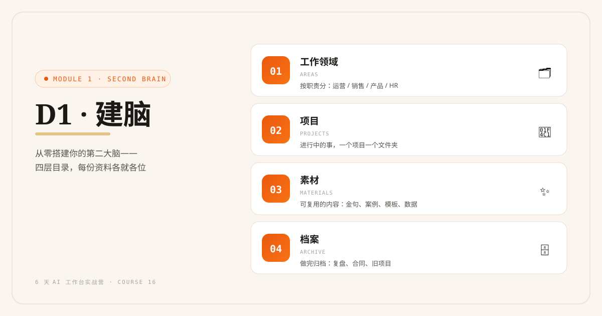
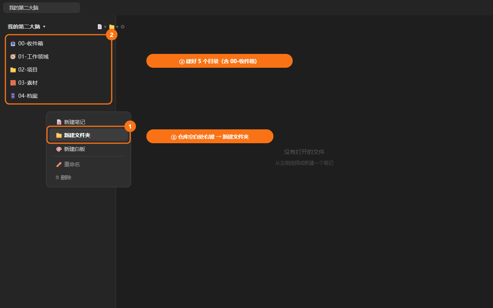
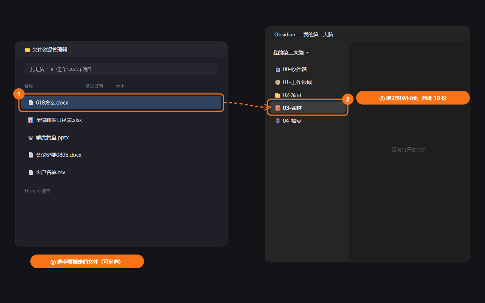
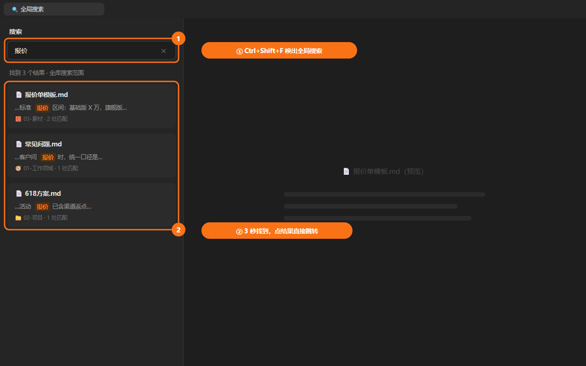

# D1: 建脑——从零搭建你的第二大脑

> 🧠 Module 1 · 第二大脑 · 第 1 天 | 认知课 30 分钟 + 实战 60–90 分钟



## 学习目标

- 理解第二大脑的三个标准：**存得下、找得到、喂给 AI 读得懂**
- 掌握 Obsidian 三个核心操作：建目录、拖入文件、全文搜索
- 设计出自己的四层目录结构
- 完成资料第一次"搬家"：首批 10 份入库

## 认知课：为什么"收藏"不等于"记住"

### 你可能已经收藏了 500 条内容，但用上过的不到 5 条

普通人管理信息的三个困境：

```text
困境一：存进去 ≠ 找得到
  → 收藏夹 800 条，要用时想不起关键词，找不到那条

困境二：找到了 ≠ 能用
  → 找到了一篇文章，但当时打动你的那个想法已经忘了

困境三：AI 时代的新问题：AI ≠ 懂你
  → ChatGPT 很聪明，但它不认识你、不知道你的工作，
    所以只能给你"通用范文"，而不是"你的答案"
```

### 第二大脑的三个标准

| 标准 | 反例 | 正解 |
|---|---|---|
| **存得下** | 微信收藏、网盘、桌面、邮箱附件，散落 6 个地方 | 一个库，一个入口 |
| **找得到** | 靠记忆翻聊天记录 | 全文搜索 30 秒内命中 |
| **喂给 AI 读得懂** | 截图、PDF 扫描件、命名混乱 | 结构化 Markdown + 清晰命名 |

**核心认知**：第二大脑不是"更大的收藏夹"，而是**你和 AI 共用的记忆体**。你负责存和判断，AI 负责检索和处理——前提是它读得懂。

### 为什么选 Obsidian

- 免费，无广告
- **本地存储**：数据在你电脑上，不上云、不怕封号、隐私可控
- 纯文本（Markdown）：任何 AI 都能直接读，10 年后也不过时
- 搜索极快，全库全文检索

### 四层目录：普通人的知识库不需要复杂

```text
我的第二大脑/
├── 00-收件箱/        ← 新资料一律先进这里，每周清空
├── 01-工作领域/      ← 按职责分：运营/销售/产品/HR……
├── 02-项目/          ← 进行中的事，一个项目一个文件夹
├── 03-素材/          ← 可复用的内容：金句、案例、模板、数据
└── 04-档案/          ← 做完归档：复盘、合同、旧项目
```

**取舍标准（什么该存）**：

```text
该存 ✅                          不该存 ❌
─────────────────────────      ─────────────────────────
以后会再用到的（≥2 次）          只用一次的临时文件
体现你经验的（方案、复盘）        别人找你要过的成品
高频引用的（数据、口径、SOP）     情绪性收藏（"感觉有用"）
```

---

## 实战任务

### 任务 1：搭好四层目录（10 分钟）

在 Obsidian 左侧文件面板：

1. 右键仓库名 → New folder，依次创建：

```text
00-收件箱
01-工作领域
02-项目
03-素材
04-档案
```



2. 在每个文件夹下建一个导航首页（可选但推荐）：

```markdown
# 📥 00-收件箱
> 新资料一律先进这里。每周五清理一次：归入 01–04 或删除。

# 🧭 01-工作领域
> 我的职责领域。每个领域一个文件夹。
- 运营/
- （你的领域……）

# 📁 02-项目
> 进行中的项目，一个项目一个文件夹。项目结束移入 04-档案。

# 🧱 03-素材
> 可复用的内容资产：金句、案例、模板、数据、截图。

# 🗄️ 04-档案
> 已完结项目的归档，只进不改。
```

3. 新建一篇仓库主页 `HOME.md`，放在仓库根目录，写下三行：

```markdown
# 我的第二大脑
- 我是谁：（一句话，D2 会扩充成完整档案）
- 今天：[[00-收件箱]] | [[02-项目]] | [[03-素材]]
- 规则：新资料先进收件箱；每周五清空收件箱
```

### 任务 2：资料第一次搬家（40–60 分钟）

按 D0 记录的"资料分布"，搬 **10 份**进库：

**操作步骤**：

1. 从"资料分布清单"里挑出**最有复用价值**的 10 份（对照上面"该存"标准）
2. 文本类内容：复制粘贴进 Obsidian 新笔记（`Ctrl+N` 新建 → 粘贴 → 保存）
3. 文件类（PDF/Word/表格）：在系统文件管理器里选中 → 拖入 Obsidian 左侧目标文件夹


4. 每份资料按命名规范起名：

```text
命名公式：[类型] 主题 - 关键词
例：
  [方案] 618大促运营方案 - 转化
  [复盘] Q3投放复盘 - 教训
  [数据] 行业口径表 - GMV定义
  [模板] 周报模板 - 部门
```

5. 全部入库后，用 `Ctrl+Shift+F`（全局搜索）搜一个你还记得的关键词——**能命中 = 搬家成功** ✅



### 任务 3：建立"只进收件箱"习惯（5 分钟）

手机上给 Obsidian 装客户端（同一仓库可同步），或在电脑桌面留一个 `→ 00-收件箱.txt` 快捷便签。

**从今天起的规则**：任何新资料，先进 `00-收件箱`，不再散落。

---

## 交付物与完成标准

| 档位 | 标准 |
|---|---|
| 🏆 完整版 | 四层目录 + 导航首页 + 首批 **10 份**资料入库 + 全局搜索能命中 |
| ✅ MVP 保底版 | 四层目录搭好 + **5 份**资料入库 |

> 剩余资料作为 D2 开始前的弹性作业，不必今天搬完。

## 实战场景

- **小李（运营）**：把"各渠道数据口径表""618 方案""季度复盘"入库——下周写周报直接搜到
- **王姐（顾问）**：把客户介绍、报价历史、课程大纲入库——客户问起 30 秒调出
- **老张（老板）**：把报价单模板、老业务员的跟进记录、常见问题入库——新人直接查库

## 常见卡点 FAQ

**Q1：Obsidian 装不上 / 打不开仓库？**
A：① 确认从官网 `obsidian.md` 下载的对应系统版本；② 仓库路径不要放在 OneDrive/ iCloud 同步冲突目录，建议放本地 `文档` 下；③ 仍失败 → 临时切飞书文档路径（见下方折叠框），别在 D1 卡环境。

**Q2：资料是 PDF/Excel，Obsidian 能存吗？**
A：能，直接拖进文件夹即可存档和搜索文件名。但 PDF 内容全文搜索需借助后续工具（D2 的 NotebookLM 路径可以直接吃 PDF）——今天先把文件存进来。

**Q3：我不知道该建哪几个"工作领域"？**
A：看你过去一个月都干了什么事，按"事"归类而不是按"部门"。写不出就先只建一个"日常"，一周后回看自然会长出来。

**Q4：搬运时忍不住想重新排版、修改内容？**
A：停。今天只搬不改。整理是 D1 之后每周五"清空收件箱"时的事，一次只做一个动作。

## 无 Obsidian 路径（飞书文档版）

<details>
<summary>📦 点开查看对照操作</summary>

| Obsidian 操作 | 飞书文档版 |
|---|---|
| 新建仓库 | 新建文件夹「我的第二大脑」 |
| 四层目录 | 文件夹下建 4 个子文件夹（同名） |
| 导航首页 | 每个⼦文件夹建一篇「置顶」文档 |
| 拖入文件 | 上传文件到对应文件夹 |
| 全局搜索 | 飞书云文档搜索框 |

</details>

## 小结

| 要点 | 说明 |
|---|---|
| 三个标准 | 存得下、找得到、喂给 AI 读得懂 |
| 四层目录 | 收件箱 / 工作领域 / 项目 / 素材 / 档案 |
| 命名公式 | `[类型] 主题 - 关键词`，为搜索而命名 |
| 只进收件箱 | 新资料不散落，每周五清空 |
| 两档标准 | 保底：目录 + 5 份；完整：目录 + 10 份 |

## 下一章预告

**D2 入库**：资料进来了，但 AI 还不认识"你"。明天我们做一次自我访谈，产出"AI 认识我"资料包——让 AI 第一次用你的口吻说话。
