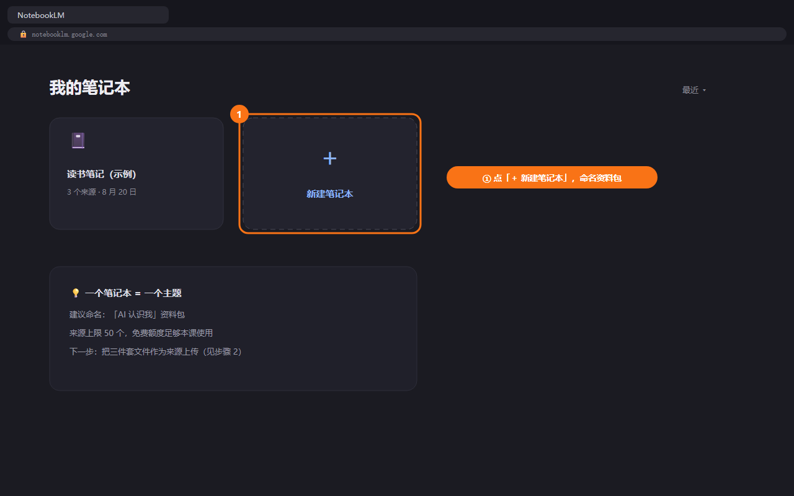
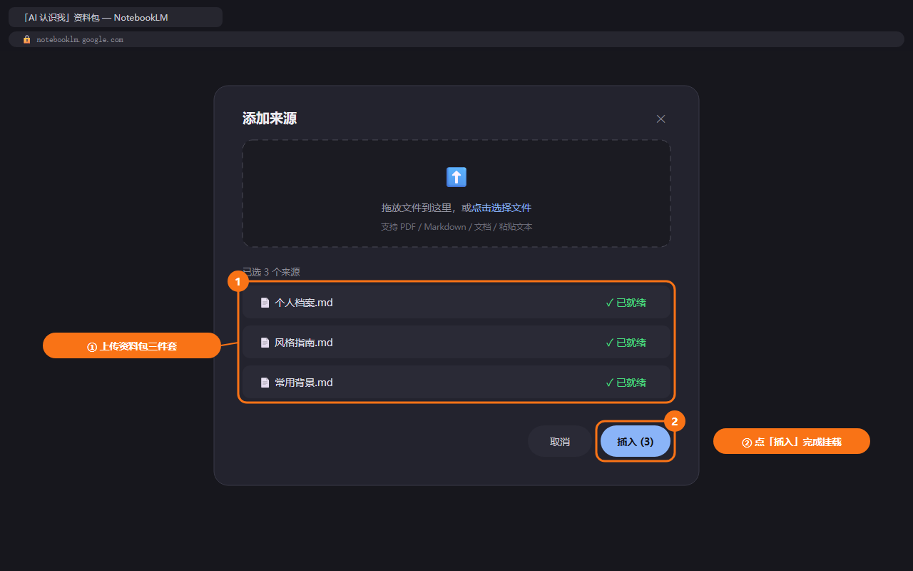
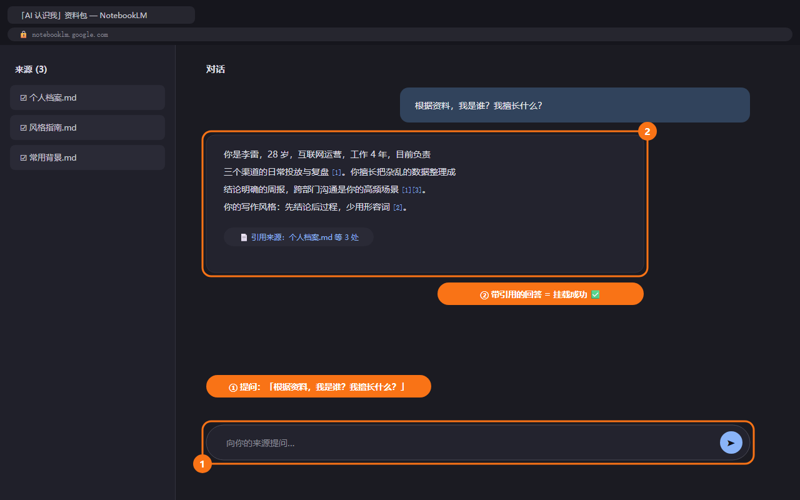

# D2: 入库——让 AI 真正认识你

> 🧠 Module 1 · 第二大脑 · 第 2 天 | 认知课 30 分钟 + 实战 60–90 分钟

## 学习目标

- 理解为什么同一个 AI，给别人写的是范文、给你写的是流水账——差别在**上下文**
- 掌握个人档案的结构化整理法（角色/职责/项目/表达/风格）
- 写出自己的 AI 上下文文件（一次写好，永久生效）
- 学会让 AI 读到知识库的三条路径
- 建立资料脱敏与安全边界意识

## 认知课：AI 的"范文病"是怎么来的

### 一个对照实验

```text
❌ 无上下文提问：
你：帮我写一段自我介绍
AI：我是一名热爱学习、积极向上的职场人……（万能废话）

✅ 有上下文提问：
你：我是谁→（档案附件）
    帮我写一段自我介绍，用于行业峰会的嘉宾介绍，200字
AI：李明，4年互联网运营，操盘过3次百万级大促……（直接能用）
```

**结论**：AI 的输出质量 = 模型能力 × **它对你的了解程度**。模型你选不了太多，了解程度完全在你手里。

### 让 AI 懂你的三件事

```text
1. 你是谁        → 角色、职责、经历（事实层）
2. 你在做什么    → 当前项目、目标、听众（场景层）
3. 你要什么风格  → 口吻、禁忌、格式偏好（风格层）
```

### AI 读取知识库的三条路径（贯穿全课）

| 路径 | 操作 | 适合 | 成本 |
|---|---|---|---|
| **① 附件/片段上传**（默认） | 对话时把要用的笔记粘贴/上传给 AI | 临时任务、所有工具 | 零门槛 |
| **② 长期挂载**（推荐） | NotebookLM 或 Claude Projects 把资料包挂为常驻上下文 | 高频复用、随问随答 | 免费、一次配置 |
| **③ Obsidian AI 插件** | 库内直接问答 | 极客玩家 | 需 API key，仅附录 |

> 本课主线用 ①②。路径 ③ 不作为主路径——对普通人它是劝退点，不是效率点。

### 安全边界：什么能喂给 AI

```text
✅ 可以入库/挂载            ⚠️ 脱敏后可以            ❌ 永远不要
────────────────      ─────────────────      ─────────────────
你自己的方法论           客户资料（去名字、         公司未公开财务
公开的行业资料            去手机号、去身份证）       密码、密钥
你的作品/方案            内部数据（只留比例，        涉及他人的隐私信息
复盘、经验教训            不留绝对值）              任何签了保密协议的内容

脱敏口诀：换名、去号、留结构。
```

---

## 实战任务

### 任务 1：AI 辅助的自我访谈（40 分钟）

把下面的访谈提纲发给 AI，让它扮演记者采访你。你口述回答（打字或语音转文字都行），最后让 AI 整理成档案。

```markdown
你好，你是我的个人档案记者。请逐条向我提问，一次只问一个，
等我回答后再问下一个。全部问完后，把我的回答整理成一份
《个人档案》，分四节：角色与职责 / 经验与作品 / 当前项目 / 表达风格。

访谈提纲：
1. 你的职业角色是什么？工作几年？在什么行业？
2. 你的日常职责有哪些？（尽量列全，这是高频任务的来源）
3. 你最有代表性的 3 个成果/项目是什么？各用一句话说明
4. 你现在手头最重要的 1-2 个项目/目标是什么？
5. 你经常需要写给谁看的东西？（领导/客户/用户/同事）
6. 你喜欢的表达风格？（正式/口语/简洁/有数据支撑……）
7. 你讨厌什么样的表达？（如：空话、过度热情、长篇大论）
8. 别人常夸你什么？常找你帮什么忙？（隐性优势）
```

**验收**：AI 输出的《个人档案》读起来像你，而不是像模板。不像就追问修改。

### 任务 2：写"风格指南 + 常用上下文"两份小文件（20 分钟）

```markdown
# 我的风格指南（放进 03-素材/）
- 称呼习惯：（如：同事直呼昵称，客户用"您"）
- 句式偏好：短句为主 / 先结论后展开
- 数据习惯：凡有数字必附来源
- 禁忌：不用感叹号、不写"赋能""抓手"

# 常用背景（每次大任务前贴给 AI 的固定开场）
- 我在 ___ 公司/行业，担任 ___
- 本次任务的读者是 ___，他最关心 ___
- 输出要求：先给结论，再给理由，最后给下一步
```

### 任务 3：组装资料包并跑通"挂载路径"（20 分钟）

1. 在知识库新建 `03-素材/AI-认识我/` 文件夹，放入三份文件：
   `个人档案.md`、`风格指南.md`、`常用背景.md`
2. **走一次推荐路径**（二选一）：
   - **NotebookLM**（`notebooklm.google.com`）：新建笔记本 → 上传这三份文件 → 提问："根据资料，我是谁？我擅长什么？"
   - **Claude Projects**：新建 Project → 把三份文件加入 Project Knowledge → 同样提问






3. **惊呼时刻验收**：让 AI **用你的口吻**写一段 100 字自我介绍——读到时你会说“这就是我” ✅

### 任务 4（弹性）：补完 D1 剩余搬家

还有资料没搬完的，现在补齐到 20 份。

---

## 交付物与完成标准

| 档位 | 标准 |
|---|---|
| 🏆 完整版 | 资料包三件套（档案+风格+背景）入库 + NotebookLM/Projects 挂载跑通 |
| ✅ MVP 保底版 | 完成个人档案（访谈核心 10 问），AI 能用你的口吻写一段自我介绍 |

## 实战场景

- **小李**：把《个人档案》贴给 AI 再写周报——AI 知道他的 KPI 口径和领导偏好，初稿可用率从 30% 到 80%
- **王姐**：客户咨询问题丢进挂载了"课程大纲+交付案例"的 NotebookLM——AI 直接按她的业务口径回答，她只做核对
- **老张**：把"常见问题+报价口径"挂载后，让文员新人照着回答客户——口径不再靠老业务员的记忆

## 常见卡点 FAQ

**Q1：NotebookLM 登录不了 / 没有账号？**
A：推荐路径不通时退回默认路径：每次对话时把相关笔记直接粘贴给 AI（3 份文件加起来不到 1000 字，粘贴无压力）。功能上 90% 等效。

**Q2：AI 整理的档案不像我？**
A：把"讨厌的表达"讲得更具体，并给它 2 段你真实写过的文字做范本："模仿这两段的口吻"。

**Q3：访谈问题答不上来（比如"别人常夸你什么"）？**
A：让 AI 换个问法，或跳过。档案是活的，D6 结营时你会再更新它一次。

**Q4：公司资料能传吗？**
A：先过安全边界三问：有保密协议吗？有他人隐私吗？有未公开财务数据吗？任一"是"→ 脱敏（换名、去号、留结构）或不上传。

## 无 Obsidian 路径（飞书文档版）

<details>
<summary>📦 点开查看对照操作</summary>

- 资料包三件套 = 飞书里建三篇文档，放进文件夹 `素材/AI-认识我/`
- 挂载路径不变：NotebookLM / Claude Projects 直接上传这三篇导出的内容（飞书文档可复制粘贴为纯文本）
- 日常使用：打开飞书文档 → 全选复制 → 粘贴进 AI 对话

</details>

## 小结

| 要点 | 说明 |
|---|---|
| 输出质量公式 | 模型 × 它对你的了解；后者全在你手里 |
| 懂你三件事 | 你是谁 / 在做什么 / 要什么风格 |
| 三条读取路径 | 附件片段（默认）、长期挂载（推荐）、插件（仅附录） |
| 资料包三件套 | 个人档案 + 风格指南 + 常用背景 |
| 安全口诀 | 换名、去号、留结构 |

## 下一章预告

**D3 对话力**：AI 认识你了，接下来学"怎么使唤它"——三步成型法 + 验收清单，让周报、邮件、方案初稿达到"能直接发"。
