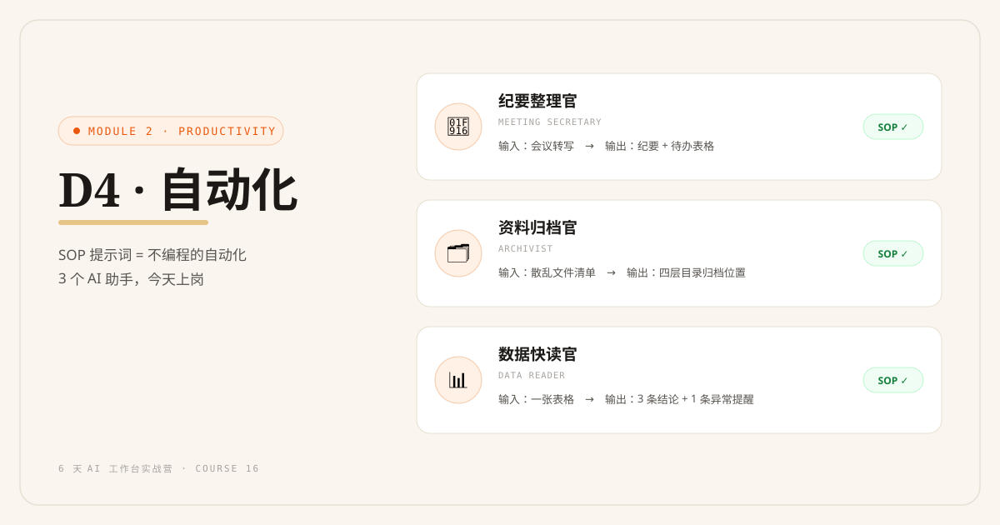
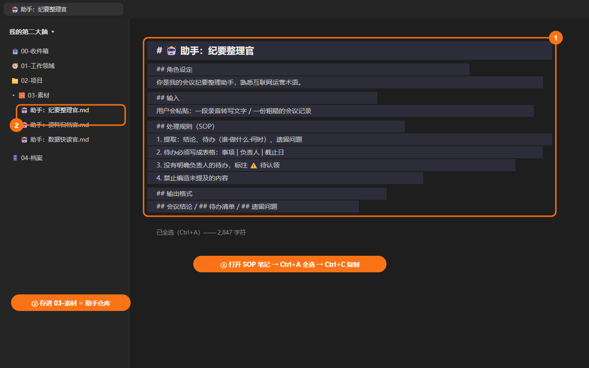
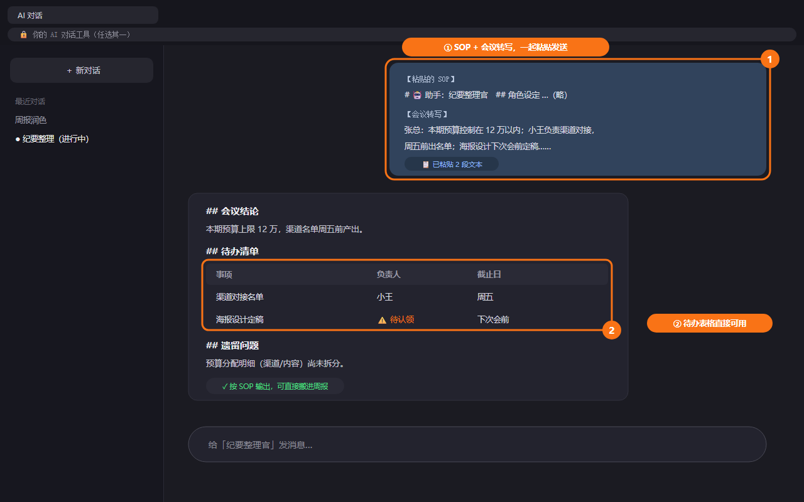

# D4: 自动化——把重复劳动交给 AI 助手

> ⚡ Module 2 · 解放生产力 · 第 4 天 | 认知课 30 分钟 + 实战 60–90 分钟



## 学习目标

- 掌握重复劳动的识别公式：**高频 + 有固定套路 + 不需要创意 = 该交给 AI**
- 会做"重复劳动盘点"
- 掌握助手的标准形态：**一条存进知识库的 SOP 提示词模板**（工具无关、免费可行）
- 上线 3 个专属 AI 助手并真实使用一次
- 了解（可选）如何把助手固化到 GPTs / Claude Projects / 智能体平台

## 认知课：助手不是聊天框，是"固化下来的工作配方"

### 重复劳动识别公式

```text
   高频？（每周 ≥ 2 次）
        │
        ▼ 是
   有固定套路？（每次步骤差不多）
        │
        ▼ 是
   不需要创意？（产出有明确的"合格标准"）
        │
        ▼ 是  → ✅ 该做成 AI 助手

反例：写年终总结（低频）、做创意提案（需要创意）→ 不适合
正例：整理会议纪要、归档资料、写跟进邮件 → 完美适合
```

### 助手的标准形态：SOP 提示词模板

本课的助手**不依赖任何平台**，就是知识库里的一篇笔记。里面写清楚四件事：

```markdown
# 🤖 助手：纪要整理官

## 角色设定
你是会议纪要整理专家，严格按照我的格式输出。

## 输入
用户会粘贴：一段录音转写文字 / 一份粗糙的会议记录

## 处理规则（SOP）
1. 提取：结论、待办（谁·做什么·何时）、遗留问题
2. 待办必须写成表格：事项 | 负责人 | 截止日
3. 没有明确负责人的待办，标注 ⚠️ 待认领
4. 禁止编造未提及的内容

## 输出格式
## 会议结论
## 待办清单（表格）
## 遗留问题
```

**为什么这是标准形态**：
- 零成本、零依赖：换任何 AI 工具都能用（粘贴即用）
- 沉淀的是**你的工作知识**：SOP 写得越好，助手越懂你的业务
- 知识库即"助手仓库"：D6 组装工作台时，它们就是台面上的"员工"

**怎么用**（两步，全程不编程）：





### 一周重复劳动盘点法

拿一张纸，回想过去一周，按三类列：

```markdown
# 我的重复劳动盘点
## 文字类（每天/每周要写的）
- 例：日报、周报、跟进邮件、朋友圈文案
## 整理类（搬运、归档、转格式）
- 例：微信文件归档、发票整理、表格合并
## 回复类（同类问题反复答）
- 例：客户询价标准回复、同事流程咨询
```

### 可选：把助手固化到平台

GPTs（ChatGPT）、Claude Projects、豆包智能体等平台可以把提示词固化为"一键助手"——好处是不用每次粘贴。**这是可选附加项**，不影响主线：知识库里的 SOP 模板才是你的资产本体，平台只是启动器。

---

## 实战任务

### 任务 1：重复劳动盘点（15 分钟）

按上面三类，列出你的一周重复劳动清单（10 条以上），然后打分筛选：

```markdown
| 重复劳动 | 频次/周 | 有套路 | 无创意 | 优先做 |
|---|---|---|---|---|
| 会议纪要整理 | 3 | ✅ | ✅ | ⭐⭐⭐ |
| …… | | | | |
```

选 **Top 3** 作为今天的助手目标。

### 任务 2：上线 3 个助手（60 分钟）

对 Top 3 的每一个，按四步走：

1. **回顾一次真实执行**：上次做这件事，我实际是怎么做的？步骤写下来
2. **写成 SOP**：套用上面的助手模板（角色设定/输入/处理规则/输出格式），处理规则里写清你的步骤和禁忌
3. **试跑一次**：拿一份真实输入（如昨天的会议转写）跑一遍
4. **修正收编**：输出不合格 → 补规则再跑；合格 → 存入 `03-素材/助手/`

**常见助手参考**（选适合你的做，不必照抄）：

```text
🗂️ 资料归档官：输入散乱文件清单 → 按我的四层目录给出归档位置
💬 初复咨询师：输入客户问题 → 按我的业务口径出回复草稿（附待确认点）
📊 数据快读官：输入一张表格数据 → 输出 3 条结论 + 1 条异常提醒
✉️ 跟进提醒官：输入会谈记录 → 输出跟进邮件 + 待办
📝 周报代笔官：输入本周事实 → 套 D3 模板直接成稿
```

### 任务 3：真实使用一次（15 分钟）

今天剩下的工作里，凡能用助手的就用助手——**必须真实用一次**，因为"上线"的定义不是写完，而是"我真的用它干了活"。

### 任务 4（可选附加）：固化到平台

把你最常用的 1 个助手配置进 GPTs / Claude Projects / 豆包智能体（平台任选），体验"一键启动"。

---

## 交付物与完成标准

| 档位 | 标准 |
|---|---|
| 🏆 完整版 | 3 个助手 SOP 入库 `03-素材/助手/` + 各真实使用一次 |
| ✅ MVP 保底版 | 先上线 1 个助手，并真实使用一次 |

## 实战场景

- **小李**：会议一结束，转写扔给"纪要整理官"，待办表格直接进周报；每周省出 2 小时
- **王姐**："初复咨询师"接管 80% 的标准咨询回复，她只核对"待确认点"；"资料归档官"每周五花 10 分钟清完收件箱
- **老张**："报价助理"按他的口径出报价区间初稿，新人也能上手报价

## 常见卡点 FAQ

**Q1：想不出自己有什么重复劳动？**
A：翻微信记录：过去一周你发出去的文字里，哪些是"第 2 次以上"写同类内容？那就是。

**Q2：助手输出的东西不够"懂行"？**
A：SOP 里的"处理规则"太笼统。把你的专业判断写成明确规则，如"报价区间必须留 15% 议价空间""技术问题一律转给王工"。助手的专业度 = 你 SOP 的颗粒度。

**Q3：SOP 写多长合适？**
A：10–30 行。超过 30 行说明这个任务该拆成两个助手，或者其中一部分步骤该你自己做。

**Q4：要分享给同事吗？**
A：可以——SOP 笔记直接发给他就能用（注意脱敏）。这正是"个人工作台 → 团队模板"的第一步（D6 会展开）。

## 无 Obsidian 路径（飞书文档版）

<details>
<summary>📦 点开查看对照操作</summary>

- 助手仓库 = 飞书文件夹 `素材/助手/`，每个助手一篇文档
- 使用：打开文档 → 复制 SOP 全文 → 粘贴到 AI 对话 → 贴上你的输入
- 固化到平台：飞书用户可配合"豆包智能体"或 Kimi 常用指令，效果等价

</details>

## 小结

| 要点 | 说明 |
|---|---|
| 识别公式 | 高频 + 有套路 + 无创意 = 该交给 AI |
| 标准形态 | 知识库里的 SOP 提示词模板（工具无关、免费、可迁移） |
| 四步上线 | 回顾执行 → 写 SOP → 试跑 → 修正收编 |
| 上线定义 | 不是写完，是"真实用它干了活" |
| 平台固化 | 可选附加项；知识库才是资产本体 |

## 下一章预告

**D5 连线**：单个助手都好用了，但任务还是要你在中间"人肉搬运"。明天画出你的任务流转图，让资料、助手、产出首尾相连——全链路跑通一个真实任务。
