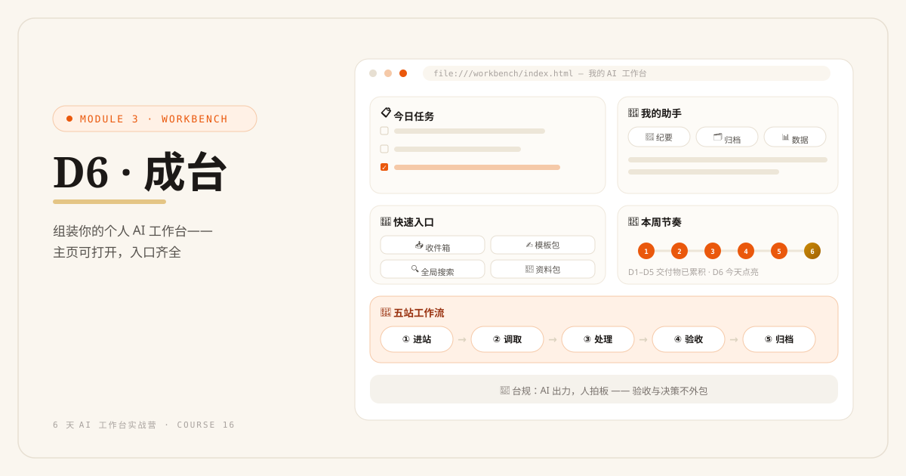
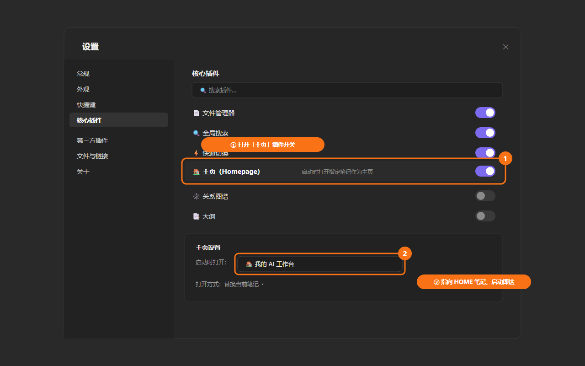
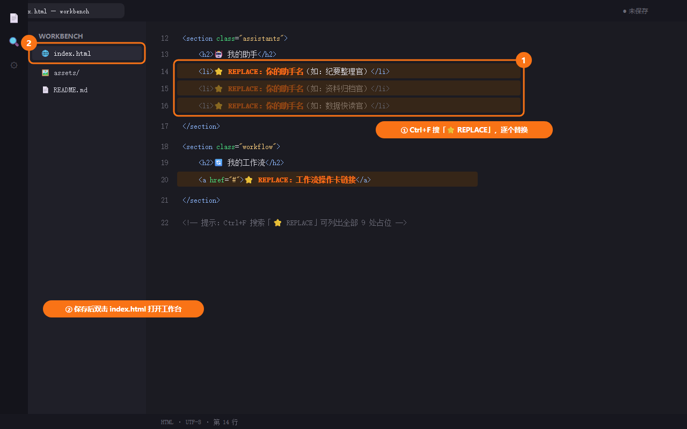

# D6: 成台——组装你的个人 AI 工作台

> 🔗 Module 3 · 打通通路 · 第 6 天（结营日） | 认知课 30 分钟 + 实战 60–90 分钟



## 学习目标

- 理解工作台的本质：**一个入口管所有**
- 把 6 天的交付物组装成有界面的工作台 1.0
- 建立每日使用流程：早晨 5 分钟规划、晚间 5 分钟归档
- 建立维护习惯：每周清理、每月复盘
- 了解个人 → 团队的迁移思路

## 认知课：工作台的本质

### 从"打开 10 个软件"到"打开一个台面"

```text
没有工作台的一天：              有工作台的一天：
上班 → 微信扫一遍（怕漏事）      上班 → 打开工作台 HOME
     → 翻文件夹找昨天的资料        → 今日任务一目了然
     → 想不起用哪个提示词           → 点进任务 → 资料就在链接里
     → 干完的东西又散落了           → 助手就在台面上
     → 下班前脑子还是乱的           → 产出归档，晚间 5 分钟收工
```

工作台不是新工具，是**你已有资产的总入口**：6 天的交付物各就各位，每天的工作从"想"变成"看"。

### 工作台 1.0 的最小构成

```text
HOME（主页）
├── 📌 今日任务        ← 今天要推进的事（含工作流操作卡链接）
├── 🧭 快速入口        → 四层目录 + 收件箱
├── 🤖 我的助手        → D4 上线的助手 SOP 一键可达
├── 🔄 我的工作流      → D5 的操作卡
└── 📅 本周节奏        → 每周固定触发的工作流时间表
```

> 课程 `demos/workbench/index.html` 提供了一个静态网页版母版（结营成果示例），可直接照抄或对照搭建。用 Obsidian 还是网页版，取决于你——界面不重要，**入口唯一**才重要。

### 每日双五分钟

```text
🌅 晨间 5 分钟（规划）
1. 打开 HOME，看今日任务
2. 从收件箱捞今天要处理的进站任务
3. 给每个任务标注：走哪条工作流

🌙 晚间 5 分钟（归档）
1. 产出全部归位（回知识库，不散落）
2. 清收件箱：归入 01–04 或删除
3. 明日任务预填一行
```

### 维护节奏

```text
每周五（15 分钟）：清空收件箱 / 检查助手 SOP 是否需要更新规则
每月末（30 分钟）：复盘——哪条工作流最省时间？哪个助手最懂你？
                   哪些资料从没被用过？（考虑删除）
```

### 个人 → 团队迁移（老张场景）

```text
个人工作台              团队工作台
────────────        ────────────
个人档案       →     岗位档案（每人一份）
助手 SOP       →     团队 SOP（脱敏后共享）
工作流操作卡   →     团队流程卡（新人照卡执行）
知识库         →     共享库（飞书/语雀更方便权限管理）
迁移路径：自己先跑通 1 个月 → 挑最成熟的一条工作流团队化 → 逐步复制
```

---

## 实战任务

### 任务 1：组装工作台 1.0（40 分钟）

**路径 A（推荐）：Obsidian 版**

1. 新建 `HOME.md`（或改造 D1 的 HOME），结构如下：

```markdown
# 🏠 我的 AI 工作台
> 更新：2026-08-25

## 📌 今日任务
- [ ] {{任务}} → 工作流：[[02-项目/工作流/周报操作卡]]
- [ ] ……

## 🧭 快速入口
[[00-收件箱]] · [[01-工作领域]] · [[02-项目]] · [[03-素材]] · [[04-档案]]

## 🤖 我的助手
[[03-素材/助手/纪要整理官]] · [[03-素材/助手/初复咨询师]] · ……

## 🔄 我的工作流
[[02-项目/工作流/Newsletter操作卡]] · [[02-项目/工作流/周报操作卡]]

## 📅 本周节奏
周四 10:00 Newsletter｜周五 17:00 周报+清收件箱
```

2. 在 Obsidian 设置中把 HOME 设为启动页（Settings → Core plugins → Homepage，或手动置顶）



**路径 B：静态网页版（课程母版）**

打开 `demos/workbench/index.html`，按母版注释把你的助手名、工作流名、常用链接替换进去，双击即开。



**验收**：从工作台出发，**3 次点击内**能到达：任一资料 / 任一助手 / 任一工作流操作卡 ✅

### 任务 2：用工作台完成今天的真实工作（30 分钟）

今天剩下的所有工作，强制自己**只从工作台进出**：

```text
□ 晨间 5 分钟做了规划
□ 每个任务从"今日任务"发起
□ 助手从台面点开使用
□ 晚间 5 分钟归档完成
```

### 任务 3：结营自检 + 30 天打卡启动（20 分钟）

对照 6 天交付物清单自检：

```markdown
# 结营自检
- [ ] D1 第二大脑骨架（四层目录 + 资料入库）
- [ ] D2 "AI 认识我"资料包（档案+风格+背景，挂载跑通）
- [ ] D3 写作模板包（≥1 套达到"能直接发"）
- [ ] D4 AI 助手 ≥1 个（真实使用过）
- [ ] D5 工作流 ≥1 条（全链路跑通）
- [ ] D6 工作台 1.0（入口唯一，3 次点击可达）
```

打印或复制 `demos/templates/d6_30天打卡表.md`，从明天开始：每天用一个 ✅ 证明工作台在转。

---

## 交付物与完成标准

| 档位 | 标准 |
|---|---|
| 🏆 完整版 | 工作台 1.0 组装完成 + 当天真实工作全程走台 + 30 天打卡启动 |
| ✅ MVP 保底版 | 工作台主页可打开，含任务中心 + 助手入口，并用它完成当天一件真实工作 |

## 实战场景

- **小李**：每天上班第一个页面从微信换成 HOME；周四周五按节奏卡自动进入对应工作流
- **王姐**：客户咨询、内容创作、资料归档三条工作流全部挂上台面；月底复盘挑出最省时的一条做成团队 SOP
- **老张**：个人台跑通一个月后，把"报价工作流"团队化，新文员照卡上手

## 常见卡点 FAQ

**Q1：工作台搭好了，坚持不了几天？**
A：两个杠杆：① 物理触发（把 HOME 网页设为浏览器主页 / Obsidian 开机自启）；② 30 天打卡表放桌面。习惯崩塌的高发期是第 2 周，打卡表就是为它准备的。

**Q2：觉得工作台很简陋，想再美化？**
A：克制。工作台的审美标准是"好用"不是"好看"。先跑 30 天，让真实使用告诉你缺什么，再迭代 2.0。

**Q3：任务和待办我本来用别的新工具？**
A：不必强求迁移。在 HOME 上放一条链接指过去即可——工作台的原则是"入口唯一"，不是"所有东西重做一遍"。

**Q4：6 天结束了，然后呢？**
A：三步走：① 30 天打卡固化习惯；② 想做一人公司商业落地 → 课程 04（OPC）；③ 想深耕内容创作 → 课程 09（AI 内容工作流）。你的工作台就是这两门课的载具。

## 无 Obsidian 路径（飞书文档版）

<details>
<summary>📦 点开查看对照操作</summary>

- HOME = 一篇置顶的飞书文档，同样的五区结构
- 内链：用飞书文档的 @ 提及 / 快捷链接替代 [[双链]]
- 启动页：把该文档"添加到桌面快捷方式"或钉在工作台顶部
- 网页版母版（路径 B）与主线完全相同

</details>

## 小结

| 要点 | 说明 |
|---|---|
| 工作台本质 | 一个入口管所有；从"想"变成"看" |
| 最小构成 | 今日任务 / 快速入口 / 助手 / 工作流 / 本周节奏 |
| 每日双五分钟 | 晨规划、晚归档 |
| 维护节奏 | 周五清理、月度复盘、敢删没用资产 |
| 团队迁移 | 自跑 1 月 → 最成熟工作流团队化 → 逐步复制 |

## 结营

6 天前你有的：散落的资料、现想的提示词、每天人肉硬扛。
6 天后你有的：**第二大脑 + 写作模板包 + 3 个 AI 助手 + 工作流 + 一个总入口**。

这不是课程的结束，是你的工作方式 2.0 的开始。30 天后见分晓。🏆
